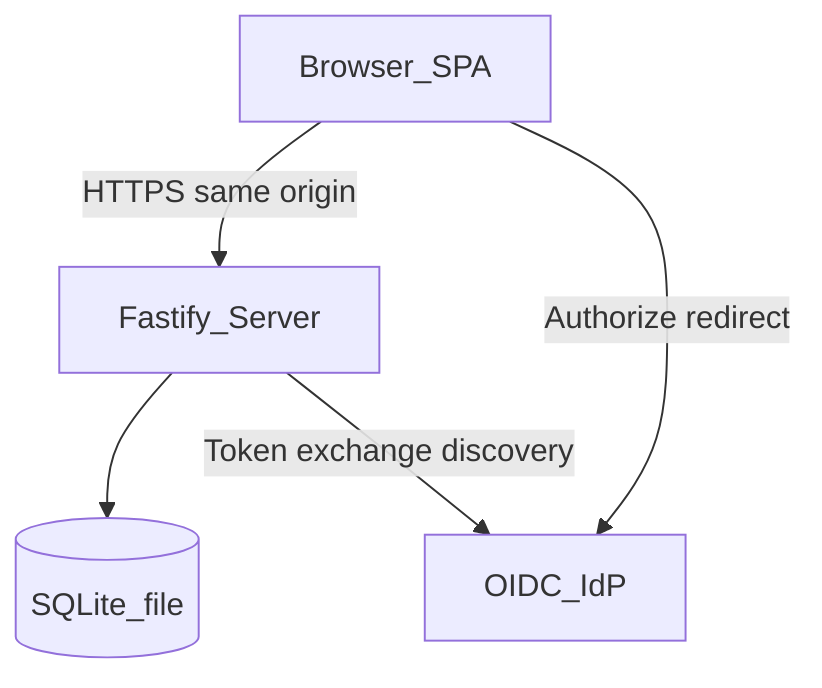

# Architecture

## Context

Genesis Lists is a classic **client–server** web application. Browsers load a static SPA; the SPA talks to a JSON API on the same origin under `/api`. Optional OpenID Connect delegates credential verification to an external IdP; the API still issues local session cookies.

## Components

| Component | Responsibility |
|-----------|----------------|
| **Web (React + Vite + MUI)** | Auth screens, lists home, list detail; Material Design 3 |
| **API (Fastify)** | REST under `/api`; session auth; optional OIDC start/callback; ownership checks |
| **SQLite** | Persistent storage on a mounted volume |
| **OIDC IdP (optional)** | Authentik or compatible provider; Authorization Code + PKCE |
| **Static hosting** | Production server serves built SPA assets (including the application icon and web manifest) and API together |

## Trust boundaries

- Unauthenticated clients may only call register (when open and password login enabled), login (when password login enabled), registration status, auth config, health, and OIDC start/callback (when OIDC enabled).
- Authenticated session cookie identifies the user; every list/item operation is scoped to that user.
- The IdP is trusted for identity claims after a successful code exchange; Genesis Lists maps claims to a local `users` row and never stores IdP access/refresh tokens long-term.
- The database file must not be exposed over HTTP; only the app process reads/writes it.

## Same-origin deployment

In production, one process (or one container) serves:

- `GET /api/*` → API
- `GET /*` → SPA (`index.html` fallback for client routes)

This avoids CORS in the default self-host setup. Local development may use a Vite proxy to the API. OIDC redirect URIs must use the public HTTPS origin (`PUBLIC_BASE_URL` or `OIDC_REDIRECT_URI`).

## Environments

| Env | Web | API | DB |
|-----|-----|-----|----|
| Development | Vite `:5173` | Fastify `:3000` | `./data/dev.db` |
| Production (Docker) | Static from API host | Same container `:3000` (or `PORT`) | Volume path e.g. `/data/app.db` |

## Extension points

- Auth provider: local password and/or OIDC ([ADR 0005](adr/0005-oidc.md))
- `list_members` table for sharing without rewriting core list/item shapes (roadmap)

See ADRs under [`adr/`](adr/) for stack choices.
