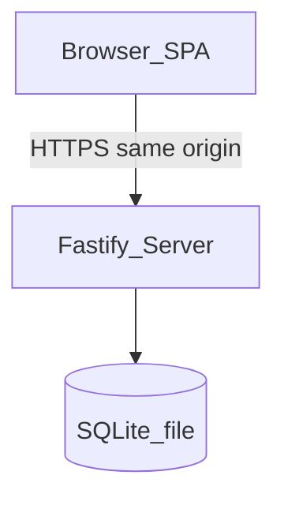

# Architecture

## Context

Genesis Lists is a classic **client–server** web application. Browsers load a static SPA; the SPA talks to a JSON API on the same origin under `/api`.

## Components

| Component | Responsibility |
|-----------|----------------|
| **Web (React + Vite + MUI)** | Auth screens, lists home, list detail; Material Design 3 |
| **API (Fastify)** | REST under `/api`; session auth; ownership checks |
| **SQLite** | Persistent storage on a mounted volume |
| **Static hosting** | Production server serves built SPA assets (including the application icon and web manifest) and API together |

## Trust boundaries

- Unauthenticated clients may only call register (when open), login, registration status, and health.
- Authenticated session cookie identifies the user; every list/item operation is scoped to that user.
- The database file must not be exposed over HTTP; only the app process reads/writes it.

## Same-origin deployment

In production, one process (or one container) serves:

- `GET /api/*` → API
- `GET /*` → SPA (`index.html` fallback for client routes)

This avoids CORS in the default self-host setup. Local development may use a Vite proxy to the API.

## Environments

| Env | Web | API | DB |
|-----|-----|-----|-----|
| Development | Vite `:5173` | Fastify `:3000` | `./data/dev.db` |
| Production (Docker) | Static from API host | Same container `:3000` (or `PORT`) | Volume path e.g. `/data/app.db` |

## Extension points (not in MVP)

- Auth provider interface for OIDC (see roadmap)
- `list_members` table for sharing without rewriting core list/item shapes

See ADRs under [`adr/`](adr/) for stack choices.
