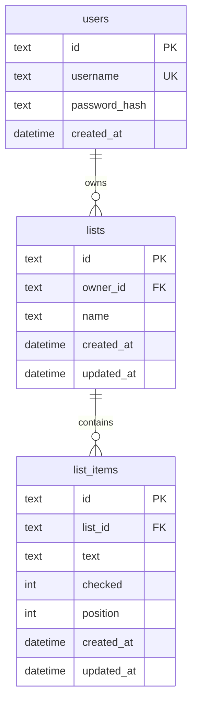

# Data Model

## Overview

## Tables

### `users`

| Column | Type | Constraints | Notes |
|--------|------|-------------|-------|
| `id` | text | PK | UUID |
| `username` | text | UNIQUE, NOT NULL | Case-sensitive store; compare as stored |
| `password_hash` | text | NOT NULL | argon2id hash; never returned by API |
| `created_at` | text (ISO-8601) | NOT NULL | UTC |

### `lists`

| Column | Type | Constraints | Notes |
|--------|------|-------------|-------|
| `id` | text | PK | UUID |
| `owner_id` | text | FK → users.id, NOT NULL | Owner |
| `name` | text | NOT NULL | Trimmed; 1–120 chars |
| `created_at` | text | NOT NULL | UTC |
| `updated_at` | text | NOT NULL | UTC; bump on rename |

### `list_items`

| Column | Type | Constraints | Notes |
|--------|------|-------------|-------|
| `id` | text | PK | UUID |
| `list_id` | text | FK → lists.id, NOT NULL, ON DELETE CASCADE | Parent list |
| `text` | text | NOT NULL | Trimmed; 1–500 chars |
| `checked` | integer | NOT NULL, default 0 | 0 = unchecked, 1 = checked |
| `position` | integer | NOT NULL | Ascending order within list; new items append (max+1) |
| `created_at` | text | NOT NULL | UTC |
| `updated_at` | text | NOT NULL | UTC |

## Ownership rules

1. A list belongs to exactly one `owner_id`.
2. An item is accessible only if its parent list’s `owner_id` equals the authenticated user.
3. On unauthorized access, respond with **404** (not 403) to avoid leaking existence.
4. Deleting a list deletes all of its items (cascade).

## Future: sharing (not MVP)

A `list_members(list_id, user_id, role)` table can grant access without changing `list_items`. Ownership remains on `lists.owner_id`. Documented in [08-roadmap.md](08-roadmap.md).

## Sessions (implementation detail)

MVP stores sessions in a `sessions` table (id, user_id, expires_at, created_at) with the session id in an HTTP-only cookie. See [07-security.md](07-security.md) and ADR 0002. Session storage is not exposed in the public API data model.
