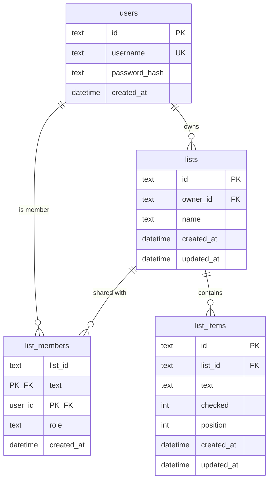

# Data Model

## Overview

## Tables

### `users`

| Column | Type | Constraints | Notes |
|--------|------|-------------|-------|
| `id` | text | PK | UUID |
| `username` | text | UNIQUE, NOT NULL | Case-sensitive store; compare as stored |
| `password_hash` | text | NOT NULL | argon2id hash; never returned by API |
| `created_at` | text (ISO-8601) | NOT NULL | UTC |

### `lists`

| Column | Type | Constraints | Notes |
|--------|------|-------------|-------|
| `id` | text | PK | UUID |
| `owner_id` | text | FK → users.id, NOT NULL | Owner |
| `name` | text | NOT NULL | Trimmed; 1–120 chars |
| `created_at` | text | NOT NULL | UTC |
| `updated_at` | text | NOT NULL | UTC; bump on rename |

### `list_members`

| Column | Type | Constraints | Notes |
|--------|------|-------------|-------|
| `list_id` | text | PK (composite), FK → lists.id, ON DELETE CASCADE | Shared list |
| `user_id` | text | PK (composite), FK → users.id, ON DELETE CASCADE | Member (never the owner) |
| `role` | text | NOT NULL | Always `member` for now (forward-compatible) |
| `created_at` | text | NOT NULL | UTC |

Unique membership is enforced by the composite primary key `(list_id, user_id)`. Index `user_id` for “lists shared with me” queries.

### `list_items`

| Column | Type | Constraints | Notes |
|--------|------|-------------|-------|
| `id` | text | PK | UUID |
| `list_id` | text | FK → lists.id, NOT NULL, ON DELETE CASCADE | Parent list |
| `text` | text | NOT NULL | Trimmed; 1–500 chars |
| `checked` | integer | NOT NULL, default 0 | 0 = unchecked, 1 = checked |
| `position` | integer | NOT NULL | Ascending order within list; new items append (max+1) |
| `created_at` | text | NOT NULL | UTC |
| `updated_at` | text | NOT NULL | UTC |

## Ownership & access rules

1. A list belongs to exactly one `owner_id`. The owner is **not** stored as a `list_members` row.
2. A user may access a list if they are the owner **or** a row exists in `list_members` for that user.
3. **Owner** may read/write items, rename, delete the list, and manage members.
4. **Member** (`role = member`) may read/write items and rename; may leave the list; may **not** delete the list or manage members.
5. On access without ownership or membership, respond with **404** (not 403) to avoid leaking existence.
6. When the user has access but lacks a capability (e.g. member deletes list), respond with **403 FORBIDDEN**.
7. Deleting a list deletes all of its items and memberships (cascade).

## Sessions (implementation detail)

Sessions are stored in a `sessions` table (id, user_id, expires_at, created_at) with the session id in an HTTP-only cookie. See [07-security.md](07-security.md) and ADR 0002. Session storage is not exposed in the public API data model. Expired session rows are deleted on startup.

Applied schema versions are stored in `schema_migrations(version, applied_at)`. See [ADR 0003](adr/0003-sqlite-default.md). That table is not part of the public API. Current schema version is **2** (`list_members`).
