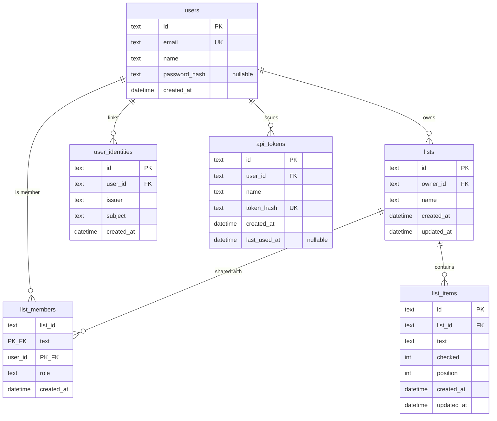

# Data Model

## Overview

## Tables

### `users`

| Column | Type | Constraints | Notes |
|--------|------|-------------|-------|
| `id` | text | PK | UUID |
| `email` | text | UNIQUE, NOT NULL | Login identifier; stored trimmed and lower-cased, so uniqueness is case-insensitive |
| `name` | text | NOT NULL | Display name shown in the UI; 1–64 chars; **not** unique; no control characters or bidi overrides; defaults to the email local part |
| `password_hash` | text | NULL | argon2id hash when set; null for OIDC-only users; never returned by API |
| `created_at` | text (ISO-8601) | NOT NULL | UTC |

`GET /api/users` exposes `id`, `name`, and `email` to any signed-in user, because non-unique names alone cannot tell two people apart in the share picker. `DIRECTORY_SHOW_EMAILS=false` drops `email` from that response. See [07-security.md](07-security.md).

### `user_identities`

| Column | Type | Constraints | Notes |
|--------|------|-------------|-------|
| `id` | text | PK | UUID |
| `user_id` | text | FK → users.id, NOT NULL, ON DELETE CASCADE | Local account |
| `issuer` | text | NOT NULL | OIDC issuer URL from discovery |
| `subject` | text | NOT NULL | OIDC `sub` claim |
| `created_at` | text | NOT NULL | UTC |

Unique constraint on `(issuer, subject)`.

### `api_tokens`

| Column | Type | Constraints | Notes |
|--------|------|-------------|-------|
| `id` | text | PK | UUID |
| `user_id` | text | FK → users.id, NOT NULL, ON DELETE CASCADE | Owning account |
| `name` | text | NOT NULL | Label (1–64 chars); not a secret |
| `token_hash` | text | UNIQUE, NOT NULL | SHA-256 hex of the plaintext token; plaintext never stored |
| `created_at` | text | NOT NULL | UTC |
| `last_used_at` | text | NULL | UTC; updated on successful Bearer auth |

Plaintext tokens use the prefix `gls_` and are returned **once** from `POST /api/auth/tokens`. Index `user_id` for listing; unique index on `token_hash` for lookup.

### `lists`

| Column | Type | Constraints | Notes |
|--------|------|-------------|-------|
| `id` | text | PK | UUID |
| `owner_id` | text | FK → users.id, NOT NULL | Owner |
| `name` | text | NOT NULL | Trimmed; 1–120 chars |
| `created_at` | text | NOT NULL | UTC |
| `updated_at` | text | NOT NULL | UTC; bump on rename |

### `list_members`

| Column | Type | Constraints | Notes |
|--------|------|-------------|-------|
| `list_id` | text | PK (composite), FK → lists.id, ON DELETE CASCADE | Shared list |
| `user_id` | text | PK (composite), FK → users.id, ON DELETE CASCADE | Member (never the owner) |
| `role` | text | NOT NULL | Always `member` for now (forward-compatible) |
| `created_at` | text | NOT NULL | UTC |

Unique membership is enforced by the composite primary key `(list_id, user_id)`. Index `user_id` for “lists shared with me” queries.

### `list_items`

| Column | Type | Constraints | Notes |
|--------|------|-------------|-------|
| `id` | text | PK | UUID |
| `list_id` | text | FK → lists.id, NOT NULL, ON DELETE CASCADE | Parent list |
| `text` | text | NOT NULL | Trimmed; 1–500 chars |
| `checked` | integer | NOT NULL, default 0 | 0 = unchecked, 1 = checked |
| `position` | integer | NOT NULL | Ascending order within list; new items append (max+1) |
| `created_at` | text | NOT NULL | UTC |
| `updated_at` | text | NOT NULL | UTC |

## Ownership & access rules

1. A list belongs to exactly one `owner_id`. The owner is **not** stored as a `list_members` row.
2. A user may access a list if they are the owner **or** a row exists in `list_members` for that user.
3. **Owner** may read/write items, rename, delete the list, and manage members.
4. **Member** (`role = member`) may read/write items and rename; may leave the list; may **not** delete the list or manage members.
5. On access without ownership or membership, respond with **404** (not 403) to avoid leaking existence.
6. When the user has access but lacks a capability (e.g. member deletes list), respond with **403 FORBIDDEN**.
7. Deleting a list deletes all of its items and memberships (cascade).

## OIDC identity rules

1. Lookup order on callback: `(issuer, subject)` → else merge by email claim → else auto-register if enabled.
2. The email from the configured claim must satisfy the same rules as local registration, and is normalized the same way before comparison. A missing or malformed claim fails the login, as does an `email_verified` claim that is present and not affirmative unless `OIDC_REQUIRE_EMAIL_VERIFIED=false`.
3. Merging by email is what links an account created before the IdP was connected to its IdP counterpart.
4. Auto-register sets `name` from the configured name claim, falling back to the email local part.
5. When a linked identity presents an email that another account already holds, the email is left unchanged rather than merging the two accounts.
6. Deleting a user cascades identity rows.

## Sessions (implementation detail)

Sessions live in a `sessions` table (id, user_id, expires_at, created_at) with the session id in an HTTP-only cookie. See [07-security.md](07-security.md) and [ADR 0002](adr/0002-auth-sessions.md). OIDC login creates the same session rows ([ADR 0005](adr/0005-oidc.md)). Expired session rows are deleted on startup.

Short-lived OIDC login state (PKCE verifier, nonce, expiry) is stored server-side in `oidc_login_states` and is not part of the public API model.

Applied schema versions are stored in `schema_migrations(version, applied_at)`. See [ADR 0003](adr/0003-sqlite-default.md). That table is not part of the public API. Schema version **2** adds `list_members`. Schema version **3** adds nullable `password_hash`, `email`, `user_identities`, and `oidc_login_states`. Schema version **4** replaces `username` with a unique `email` and adds `name` ([ADR 0006](adr/0006-email-login-identifier.md)). Schema version **5** adds `oidc_login_states.client` and `oidc_mobile_tickets` for Android OIDC ticket exchange ([ADR 0007](adr/0007-android-companion.md)). Schema version **6** adds `api_tokens` for Bearer personal access tokens.

### Schema version 4 is destructive

Migration 4 rebuilds `users`. A pre-v4 account is carried over only if an email address can be recovered for it:

- The username is used when it is already a valid address, so password logins keep working. Pre-v4 usernames were restricted to `[a-zA-Z0-9_-]`, so this only applies to a hand-edited database. Otherwise the v3 `email` column is used, which rescues accounts that signed in through an IdP. In practice that means local password accounts are removed and IdP-linked accounts survive.
- For a carried-over account, `email` is that address trimmed and lower-cased, and `password_hash` and `created_at` are unchanged. Lists, items, memberships, sessions, and identity rows survive.
- `name` is the old username, so the account keeps the label other people knew it by. When the username is itself an address, the email local part is used instead so the address does not become the display name. A username that no longer satisfies the display-name rules also falls back to the local part.
- Any other account is **deleted**, together with the lists it owns (and those lists' items and memberships), its memberships of other people's lists, its sessions, and its identity rows. The migration logs a warning naming the removed accounts.
- If two accounts resolve to the same email, the oldest `created_at` wins and the others are removed as above.

Operators must back up the database before upgrading; see [06-self-hosting.md](06-self-hosting.md).
