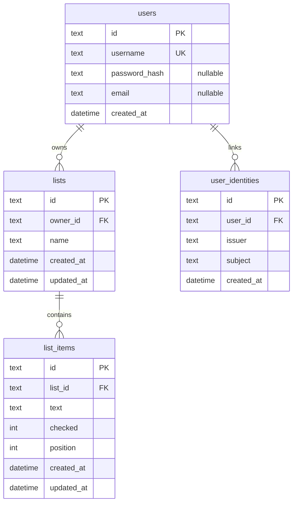

# Data Model

## Overview

## Tables

### `users`

| Column | Type | Constraints | Notes |
|--------|------|-------------|-------|
| `id` | text | PK | UUID |
| `username` | text | UNIQUE, NOT NULL | Case-sensitive store; compare as stored |
| `password_hash` | text | NULL | argon2id hash when set; null for OIDC-only users; never returned by API |
| `email` | text | NULL | Optional; from OIDC `email` claim when present; not unique in v1 |
| `created_at` | text (ISO-8601) | NOT NULL | UTC |

### `user_identities`

| Column | Type | Constraints | Notes |
|--------|------|-------------|-------|
| `id` | text | PK | UUID |
| `user_id` | text | FK → users.id, NOT NULL, ON DELETE CASCADE | Local account |
| `issuer` | text | NOT NULL | OIDC issuer URL from discovery |
| `subject` | text | NOT NULL | OIDC `sub` claim |
| `created_at` | text | NOT NULL | UTC |

Unique constraint on `(issuer, subject)`.

### `lists`

| Column | Type | Constraints | Notes |
|--------|------|-------------|-------|
| `id` | text | PK | UUID |
| `owner_id` | text | FK → users.id, NOT NULL | Owner |
| `name` | text | NOT NULL | Trimmed; 1–120 chars |
| `created_at` | text | NOT NULL | UTC |
| `updated_at` | text | NOT NULL | UTC; bump on rename |

### `list_items`

| Column | Type | Constraints | Notes |
|--------|------|-------------|-------|
| `id` | text | PK | UUID |
| `list_id` | text | FK → lists.id, NOT NULL, ON DELETE CASCADE | Parent list |
| `text` | text | NOT NULL | Trimmed; 1–500 chars |
| `checked` | integer | NOT NULL, default 0 | 0 = unchecked, 1 = checked |
| `position` | integer | NOT NULL | Ascending order within list; new items append (max+1) |
| `created_at` | text | NOT NULL | UTC |
| `updated_at` | text | NOT NULL | UTC |

## Ownership rules

1. A list belongs to exactly one `owner_id`.
2. An item is accessible only if its parent list’s `owner_id` equals the authenticated user.
3. On unauthorized access, respond with **404** (not 403) to avoid leaking existence.
4. Deleting a list deletes all of its items (cascade).

## OIDC identity rules

1. Lookup order on callback: `(issuer, subject)` → else merge by username claim → else auto-register if enabled.
2. Username from the configured claim must satisfy the same username rules as local registration.
3. Deleting a user cascades identity rows.

## Future: sharing (not this release)

A `list_members(list_id, user_id, role)` table can grant access without changing `list_items`. Ownership remains on `lists.owner_id`. Documented in [08-roadmap.md](08-roadmap.md).

## Sessions (implementation detail)

Sessions live in a `sessions` table (id, user_id, expires_at, created_at) with the session id in an HTTP-only cookie. See [07-security.md](07-security.md) and [ADR 0002](adr/0002-auth-sessions.md). OIDC login creates the same session rows ([ADR 0005](adr/0005-oidc.md)).

Short-lived OIDC login state (PKCE verifier, nonce, expiry) is stored server-side in `oidc_login_states` and is not part of the public API model.

Applied schema versions are stored in `schema_migrations(version, applied_at)`. See [ADR 0003](adr/0003-sqlite-default.md). That table is not part of the public API. Schema version **2** adds nullable `password_hash`, `email`, `user_identities`, and `oidc_login_states`.
