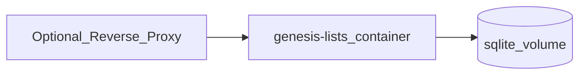

# Self-Hosting

## Default model

One Docker Compose service runs the API and serves the built SPA. SQLite lives on a named volume.



## Environment variables

| Variable | Required | Default | Description |
|----------|----------|---------|-------------|
| `PORT` | No | `3000` | HTTP listen port |
| `SESSION_SECRET` | **Yes** (production) | — | Secret for signing/encrypting sessions; long random string |
| `DATABASE_PATH` | No | `/data/app.db` | SQLite file path |
| `NODE_ENV` | No | `production` | Node environment |
| `COOKIE_SECURE` | No | `true` when production | Set `false` only for local HTTP testing |

## Compose sketch

```yaml
services:
  app:
    build: .
    ports:
      - "3000:3000"
    environment:
      SESSION_SECRET: change-me
      DATABASE_PATH: /data/app.db
    volumes:
      - genesis-data:/data

volumes:
  genesis-data:
```

Exact file: repository root `docker-compose.yml`.

## Reverse proxy / HTTPS

Terminate TLS at Caddy, Traefik, or nginx. Forward to `http://app:3000`. Ensure `COOKIE_SECURE=true` and users hit HTTPS so session cookies are sent.

## Backup

1. Stop or briefly quiesce writes if possible.
2. Copy the SQLite file from the volume (e.g. `/data/app.db`).
3. Optionally use `sqlite3 .backup` for a consistent copy while running.

Restore by replacing the file (with the app stopped) and restarting.

## Upgrades

Pull/rebuild image, recreate container, keep the same volume. Run DB migrations on startup (app responsibility).
