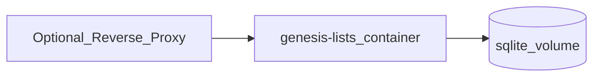

# Self-Hosting

## Default model

One Docker Compose service runs the API and serves the built SPA. SQLite lives on a named volume.



## Environment variables

| Variable | Required | Default | Description |
|----------|----------|---------|-------------|
| `PORT` | No | `3000` | HTTP listen port |
| `SESSION_SECRET` | **Yes** when `COOKIE_SECURE=true` | Dev/local placeholder | Secret used to **sign** the session cookie; long random string. Known placeholders (`change-me`, `change-me-to-a-long-random-string`, `dev-insecure-session-secret-change-me`) are rejected when `COOKIE_SECURE=true`. Local HTTP (`COOKIE_SECURE=false`) may use a placeholder and logs a warning. |
| `DATABASE_PATH` | No | `/data/app.db` in Docker; `./data/dev.db` in local dev | SQLite file path |
| `NODE_ENV` | No | `production` (Compose) | Node environment |
| `COOKIE_SECURE` | No | Compose: `false` (local HTTP). App: `true` when `NODE_ENV=production` if unset | Set `true` behind HTTPS. Set `false` only for local HTTP testing |
| `STATIC_DIR` | No | `/app/apps/web/dist` in Docker | Directory of the built SPA |

JSON request bodies larger than **16 KiB** are rejected (`400 VALIDATION_ERROR`).

On startup the app **bootstraps the schema** with `CREATE TABLE IF NOT EXISTS` (not a separate migration runner). Existing databases are left intact; new tables/indexes are added if missing.

## Compose file

The build context ignores `node_modules` and local data files (see `.dockerignore`) so the Linux image is not polluted by the host install.

```yaml
services:
  app:
    build: .
    ports:
      - "3000:3000"
    environment:
      SESSION_SECRET: ${SESSION_SECRET:-change-me-to-a-long-random-string}
      DATABASE_PATH: /data/app.db
      STATIC_DIR: /app/apps/web/dist
      COOKIE_SECURE: ${COOKIE_SECURE:-false}
      NODE_ENV: production
      PORT: 3000
    volumes:
      - genesis-data:/data
    restart: unless-stopped

volumes:
  genesis-data:
```

`COOKIE_SECURE` defaults to `false` so `docker compose up` works on `http://localhost:3000`. The placeholder `SESSION_SECRET` is allowed in that mode and prints a warning. For a public or HTTPS deploy, set a strong `SESSION_SECRET` and `COOKIE_SECURE=true`.

## Reverse proxy / HTTPS

Terminate TLS at Caddy, Traefik, or nginx. Forward to `http://app:3000`. Ensure `COOKIE_SECURE=true`, a strong `SESSION_SECRET`, and that users hit HTTPS so session cookies are sent.

Rate-limit `/api/auth/login` and `/api/auth/register` at the reverse proxy if the instance is reachable from the public internet (the app does not ship a distributed rate limiter).

## Backup

1. Stop or briefly quiesce writes if possible.
2. Copy the SQLite file from the volume (e.g. `/data/app.db`).
3. Optionally use `sqlite3 .backup` for a consistent copy while running.

Restore by replacing the file (with the app stopped) and restarting.

## Upgrades

Pull/rebuild image, recreate container, keep the same volume. Schema bootstrap runs on startup and is idempotent.
