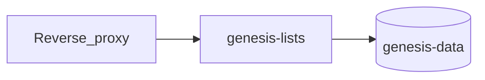

# Self-hosting

This is the setup guide for running Genesis Lists yourself. You do not need the source code once a release image is published.

## What you are running

One container serves the website and the API. Lists live in a SQLite file on a Docker volume named `genesis-data`. Compose prefixes that with the project name (usually the folder name), so the volume is often `genesis-lists_genesis-data`. Renaming the project or the volume makes the app look empty; the old data is still in the previous volume (`docker volume ls`).



## Requirements

- Docker Engine with Compose v2.
- About 256 MB of RAM and a few hundred MB of disk for a household install. The SQLite file grows with your lists.
- For a public URL: a domain and a reverse proxy that terminates HTTPS (example below).

## 1. Local try-out

From a clone of this repository:

```bash
docker compose up -d --build
```

Open http://localhost:3000 and create an account. Local Compose leaves `COOKIE_SECURE=false` (plain HTTP) and `ALLOW_REGISTRATION=true` (anyone who can open the URL can register). That is fine on your machine. Do not publish port 3000 to the internet with those defaults.

Until the `v0.2.0` image is on GHCR, `--build` is required. After it is published, `docker compose pull` uses `ghcr.io/xeiverse/genesis-lists`.

## 2. Production

### Secret

```bash
openssl rand -base64 32
```

Put the value in an env file. Do not commit it. Copy [`deploy/env.production.example`](../deploy/env.production.example):

```bash
cp deploy/env.production.example .env
# edit .env and set SESSION_SECRET
```

`COOKIE_SECURE=true` refuses to start if `SESSION_SECRET` is missing, shorter than 32 characters, or a known placeholder (`change-me`, `secret`, and the strings in the example file).

### Registration

Anyone who can open the site can create an account when registration is open. That writes into your database.

| `ALLOW_REGISTRATION` | Behavior |
|----------------------|----------|
| unset, empty, or `bootstrap` | Open until the first account exists, then closed |
| `true` | Always open |
| `false` | Always closed, including before the first account |

Local Compose defaults this to `true`. A production env file should set `ALLOW_REGISTRATION=bootstrap` (or omit it only if you are not using the Compose default). After the first account, registration is already closed. To add another person: set `ALLOW_REGISTRATION=true`, `docker compose up -d`, let them register, set it back to `bootstrap` or `false`, and recreate the container.

The app logs a warning while registration is explicitly open.

### Start

```bash
docker compose --env-file .env up -d
```

From source (or before the image exists on GHCR):

```bash
docker compose --env-file .env up -d --build
```

Check:

```bash
curl -fsS http://127.0.0.1:3000/api/health
```

A healthy process returns `"status":"ok"`, a `version`, and `schemaVersion`. `503` means the process is up but SQLite could not be queried.

### HTTPS (Caddy)

Do not expose port 3000 publicly. Terminate TLS in front of the container and set `COOKIE_SECURE=true`. A starter Caddyfile is [`deploy/Caddyfile.example`](../deploy/Caddyfile.example).

Typical Compose addition (same Docker network as the app; do not publish `3000` in this case — remove the `ports` mapping or bind it to localhost):

```yaml
services:
  caddy:
    image: caddy:2
    ports:
      - "80:80"
      - "443:443"
    volumes:
      - ./Caddyfile:/etc/caddy/Caddyfile:ro
      - caddy-data:/data
    restart: unless-stopped

volumes:
  caddy-data:
```

**Login succeeds, then you are immediately logged out** almost always means the session cookie is marked `Secure` (`COOKIE_SECURE=true`) while the browser is on plain HTTP, or the reverse (`COOKIE_SECURE=false` is fine only for HTTP). Users must hit HTTPS, and the proxy must forward to `http://app:3000`.

If the instance is reachable from the public internet, rate-limit `POST /api/auth/login` and `POST /api/auth/register` at the proxy. The app does not ship a distributed rate limiter.

## Environment variables

| Variable | Required | Default | Description |
|----------|----------|---------|-------------|
| `PORT` | No | `3000` | HTTP listen port inside the container |
| `SESSION_SECRET` | **Yes** when `COOKIE_SECURE=true` | Dev/local placeholder | Signs the session cookie. When `COOKIE_SECURE=true`, must be at least 32 characters and must not be a known placeholder. Local HTTP may use a placeholder and logs a warning. Changing this signs everyone out. |
| `DATABASE_PATH` | No | `/data/app.db` in Docker; `./data/dev.db` in local dev | SQLite file path |
| `NODE_ENV` | No | `production` (Compose) | Node environment |
| `COOKIE_SECURE` | No | Compose: `false` (local HTTP). App: `true` when `NODE_ENV=production` if unset | `true` behind HTTPS. `false` only for local HTTP |
| `ALLOW_REGISTRATION` | No | App: bootstrap. Compose default: `true` | `true`, `false`, or `bootstrap`. See above |
| `STATIC_DIR` | No | `/app/web` in the Docker image | Directory of the built SPA |
| `APP_VERSION` | No | Server package version | Reported by `/api/health`. Set from the image tag in Compose (`GENESIS_LISTS_VERSION`) |
| `GENESIS_LISTS_VERSION` | No | `0.2.0` | Compose-only. Image tag to pull, and the `APP_VERSION` passed into the container |
| `PUBLIC_BASE_URL` | When OIDC enabled (unless `OIDC_REDIRECT_URI` set) | — | Canonical public origin, e.g. `https://lists.example.com` (no trailing path). Used to build the OIDC redirect URI |
| `OIDC_ENABLED` | No | `false` | Enable OpenID Connect login |
| `OIDC_ISSUER_URL` | When OIDC enabled | — | IdP issuer / discovery base (`.well-known/openid-configuration` optional) |
| `OIDC_CLIENT_ID` | When OIDC enabled | — | Confidential client id |
| `OIDC_CLIENT_SECRET` | When OIDC enabled | — | Client secret |
| `OIDC_SCOPE` | No | `openid profile email` | Space-delimited scopes |
| `OIDC_BUTTON_TEXT` | No | `Sign in with OIDC` | Login button label |
| `OIDC_AUTO_REGISTER` | No | `true` | Create a local user on first OIDC login when no email match exists |
| `OIDC_AUTO_LAUNCH` | No | `false` | Skip the login form and start OIDC immediately |
| `OIDC_EMAIL_CLAIM` | No | `email` | Claim matched against the local account email (merge / create). Must be a valid address |
| `OIDC_NAME_CLAIM` | No | `name` | Claim used as the display name when auto-registering; falls back to the email local part |
| `OIDC_DISABLE_PASSWORD_LOGIN` | No | `false` | When `true` and OIDC is enabled, reject local password login/register |
| `OIDC_REDIRECT_URI` | No | derived | Full callback URL override; default `{PUBLIC_BASE_URL}/api/auth/oidc/callback` |

When `OIDC_ENABLED=true`, the process refuses to start if issuer, client id/secret, or redirect base URL are missing, or if OIDC discovery fails. Step-by-step Authentik setup: [guides/oauth-authentik.md](guides/oauth-authentik.md).

JSON request bodies larger than **16 KiB** are rejected (`400 VALIDATION_ERROR`).

## Data and upgrades

On startup the app applies numbered schema steps and records them in `schema_migrations`. Existing 0.1 databases are left intact. Later releases add a migration step instead of expecting you to edit the file. `GET /api/health` includes `schemaVersion` so you can confirm the upgrade ran.

### Upgrading to schema version 4 deletes non-email accounts

> **Back up `app.db` before this upgrade.** There is no automatic rollback and no downgrade path.

Accounts are now identified by email address instead of username ([ADR 0006](adr/0006-email-login-identifier.md)). When the server first starts on this version it rewrites the `users` table:

- An account whose username is already a valid email address is kept. Its email is that address (lower-cased), its display name becomes the part before the `@`, and its password, lists, shares, and sessions are untouched.
- **Every other account is deleted**, along with the lists it owns, the items on those lists, its memberships of other people's lists, and its sessions. Those people must register again with an email address, and their lists must be recreated.
- The server logs a warning naming each removed account.

Check the log after the upgrade:

```bash
docker compose logs genesis-lists | grep "Schema v4"
```

If you need the old data, stop the container, restore your backup, and export what you need before retrying. To preview the damage first, list the usernames that are not email addresses:

```bash
sqlite3 app.db "SELECT username FROM users WHERE username NOT LIKE '%_@_%.__%';"
```

The image runs as user id **10001**. A volume created by an older root image can fail with `EACCES` on `/data`. One-time fix (project name prefix may differ; check `docker volume ls`):

```bash
docker compose stop
docker run --rm -v genesis-lists_genesis-data:/data alpine chown -R 10001:10001 /data
docker compose up -d
```

### Backup

The database uses WAL. Copying only `app.db` while the app is running can miss recent writes. Prefer a SQLite backup. The image includes the `sqlite3` CLI. The app user can write into `/data`.

```bash
docker compose exec app sqlite3 /data/app.db ".backup /data/genesis-lists-backup.db"
docker compose cp app:/data/genesis-lists-backup.db ./genesis-lists-backup.db
docker compose exec app rm -f /data/genesis-lists-backup.db
```

If `exec` is unavailable, stop the app and copy the database and its sidecars:

```bash
docker compose stop
docker run --rm -v genesis-lists_genesis-data:/data -v "$PWD":/backup alpine \
  sh -c "cp /data/app.db /data/app.db-wal /data/app.db-shm /backup/ 2>/dev/null || cp /data/app.db /backup/"
docker compose up -d
```

### Restore

Stop the app, replace the database, and remove stale WAL files so SQLite does not replay an old journal over the restored file.

```bash
docker compose stop
docker run --rm -v genesis-lists_genesis-data:/data -v "$PWD":/backup alpine \
  sh -c "cp /backup/genesis-lists-backup.db /data/app.db && rm -f /data/app.db-wal /data/app.db-shm && chown 10001:10001 /data/app.db"
docker compose up -d
```

### Upgrade

Image tags such as `0.2.0` are immutable. Pin `GENESIS_LISTS_VERSION` in `.env`. Do not follow `latest` for an install you need to roll back.

1. Back up (above).
2. Set `GENESIS_LISTS_VERSION` to the new tag (for example `0.2.0`).
3. Pull and recreate, keeping the same volume:

```bash
docker compose pull
docker compose up -d
curl -fsS http://127.0.0.1:3000/api/health
```

4. Confirm `version` and `schemaVersion` in the health response.

From source, use `docker compose up -d --build` instead of `pull`.

### Rollback

Set `GENESIS_LISTS_VERSION` back to the previous tag, `docker compose pull && docker compose up -d`. Do not roll back the image after a migration you have not tested; backup first so you can restore the file as well.

Changing `SESSION_SECRET` invalidates every signed cookie. Everyone must log in again. The database itself is unchanged.

## Troubleshooting

| Symptom | What to check |
|---------|----------------|
| Container exits immediately, log says `SESSION_SECRET is required` | `COOKIE_SECURE=true` with a missing, short, or placeholder secret. Generate a new one and recreate. |
| Login works, then you are logged out | `COOKIE_SECURE` does not match the URL scheme. HTTPS requires `true`. HTTP (localhost only) requires `false`. |
| Empty lists after an update | Volume name changed (`docker volume ls`). Point Compose back at the volume that has `app.db`. |
| `EACCES` writing `/data` | Volume is still owned by root. `chown` to `10001:10001` as above. |
| Register link is missing; register page says registration is closed | Expected after the first account when mode is `bootstrap`. Set `ALLOW_REGISTRATION=true`, recreate, add the account, then close it again. Also hidden when `OIDC_DISABLE_PASSWORD_LOGIN=true`. |
| `/api/health` is `503` | Process is up but SQLite failed. Check the volume mount and file permissions. |
| Cannot pull `ghcr.io/xeiverse/genesis-lists` | The tag has not been published yet. Use `docker compose up -d --build` from a checkout of that version. |
| OIDC container exits on start | Missing `OIDC_*` / `PUBLIC_BASE_URL`, or discovery unreachable from the container. See [Authentik guide](guides/oauth-authentik.md). |
| OIDC returns to `/login?error=oidc` | Check redirect URI, that the IdP releases a valid `email` claim (and does not send `email_verified: false`), and auto-register; inspect app logs. |
